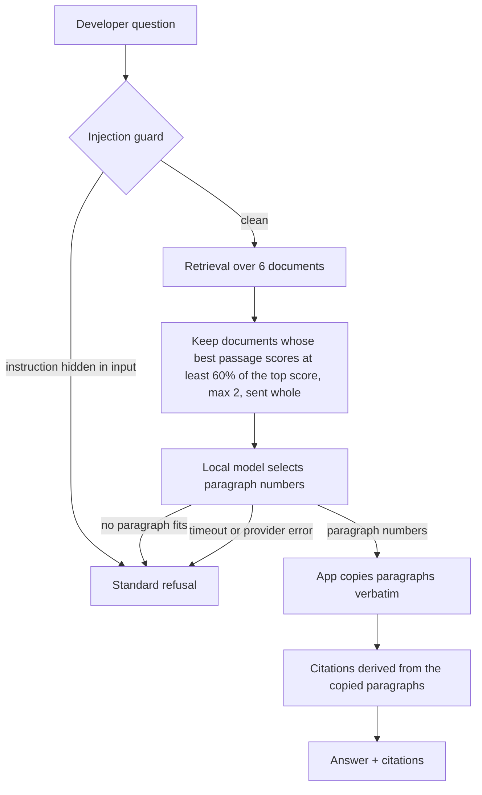

# grounded-research-agent

A research assistant that answers developer questions **only from its documents**, cites its sources, and refuses when the answer is not there.

It runs fully locally on a 14B open-weight model (Ollama, `qwen2.5:14b-instruct`). No API key, no paid model.

**Result:** 15/15 on the private grader of the Dev3Pack AI Engineering Bootcamp, including all 6 safety-critical questions (2 adversarial prompts, 4 questions that must be refused). Certificate earned.

---

## Why this project matters

An assistant that sounds confident but invents facts is worse than no assistant.

This agent is built around three rules:

1. **Every answer comes from a document.** No source, no answer.
2. **Citations cannot be invented.** They are derived from the text the agent actually returns.
3. **Refusing is a valid answer.** When the documents do not cover the question, the agent says so in a standard sentence.

Think of it as a compliance officer, not a copywriter: it quotes the policy, it does not paraphrase it.

---

## How it works

The key design choice: **the model does not write the answer. It selects it.**

A small local model paraphrases poorly. It turns "bound capabilities" into "bounding capabilities", drops the last item of a list, or breaks the JSON format. But it is good at judging *which paragraph answers the question*. So the model picks paragraph numbers, and the application copies those paragraphs word for word.



The refusal sentence is always the same: *"I do not know based on the provided documents."* A fixed sentence is easy to test and impossible to misread.

### What the code checks, so the model does not have to

| Risk | Safeguard in code |
|---|---|
| Invented citation | Citations come only from the copied paragraphs |
| Paraphrase that changes the meaning | The answer is the source text, copied verbatim |
| Prompt injection inside the question | Guard runs before any model call |
| Broken JSON from the model | Local repair, no extra model call |
| Model copies text itself and loses spaces | A free-form answer that shares at least half its words with a paragraph is replaced by that exact paragraph |
| Slow or failing model | Timeout and provider error become a flagged refusal |

---

## Results

Measured on the course's 10 training questions, then on the 15 private questions.

| Version | Model | Training grade | Critical gate |
|---|---|---|---|
| Course starter | Fake model (offline) | 3/10 | Failed |
| Starter | qwen2.5:7b-instruct | 4/10 | Failed |
| Extractive prompt, citation filter | qwen2.5:14b-instruct | 5/10 → 6/10 | Failed |
| **Model selects, app copies** | qwen2.5:14b-instruct | **9/10** (3 runs in a row) | **Passed** |
| Official private grader | qwen2.5:14b-instruct | **15/15** | **Passed** (6/6 critical) |

Tests: `pytest` → 7 passed, 2 skipped.

**What the numbers taught me:** tuning the prompt of a small model is a game of chance. Each prompt fix moved the failure to another question. Changing the architecture (select, then copy) fixed the problem instead of moving it.

---

## Known limits

- The 60% retrieval threshold was chosen by looking at retrieval scores on the training set. It may not hold on a different corpus.
- One source per answer. A question that needs two documents combined gets only the best one.
- Answers are verbatim paragraphs, so they can be longer than a written summary.

---

## Run it

```bash
git clone https://github.com/Mialy333/grounded-research-agent && cd grounded-research-agent
uv sync

# Contract tests, offline (no model needed): 7 passed, 2 skipped
uv run pytest

# Local model (about 9 GB)
ollama pull qwen2.5:14b-instruct

# Point the agent at it: copy the example config, then set
#   BOOTCAMP_PROVIDER=ollama
#   BOOTCAMP_MODEL=qwen2.5:14b-instruct
cp .env.example .env

# One answered question, one refused question, with the full trace
uv run bootcamp capstone trace "How does chunking work in RAG?"
uv run bootcamp capstone trace "What is the capital city of Mongolia?"

# Practice grader (10 training questions)
uv run bootcamp capstone grade
```

---

## Built on

- Starter repository and private grader: [Dev3Pack AI Engineering Bootcamp](https://github.com/Gecko-Academy/dev3pack-cohort-2026-09) (cohort Sept 2026).
- The starter provides the pipeline studied during the course: model adapter, structured outputs, bounded tools, agent loop, retrieval.
- My work: model choice and runs, diagnosis from traces, and the evolution of `agent.py` up to the select-then-copy architecture.

## Stack

Python 3.11 · uv · Ollama · qwen2.5:14b-instruct · pytest · ruff
